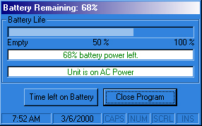



## Battery Life

### Description

UPDATED- I added comments to the code.

This program uses the sysinfo control to monitor battery use on a laptop. The screenshot say more than I can type here. I would ask that if anyone knows how to show the info for 2 batteries, I would appreciate an email with how... Thanks
 
### More Info
 

             |
---                |---
**Submitted On**   |2000-03-07 08:56:16
**By**             |[VBScript](https://github.com/Planet-Source-Code/PSCIndex/blob/master/ByAuthor/vbscript.md)
**Level**          |Intermediate
**User Rating**    |5.0 (10 globes from 2 users)
**Compatibility**  |VB 5\.0, VB 6\.0
**Category**       |[Miscellaneous](https://github.com/Planet-Source-Code/PSCIndex/blob/master/ByCategory/miscellaneous__1-1.md)
**World**          |[Visual Basic](https://github.com/Planet-Source-Code/PSCIndex/blob/master/ByWorld/visual-basic.md)
**Archive File**   |[CODE\_UPLOAD3847372000\.zip](https://github.com/Planet-Source-Code/vbscript-battery-life__1-6452/archive/master.zip)

